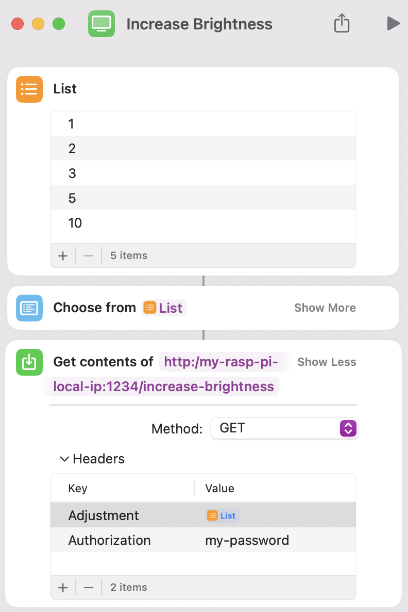

[](https://github.com/austin-weeks/tv-control-server/actions/workflows/Tests.yml)
[](https://github.com/austin-weeks/tv-control-server/actions/workflows/CD.yml)

# 📺 Samsung TV Control Server

A server for controlling your Samsung TV - all without a remote! The project exposes HTTP endpoints to adjust your TV's brightness and is easily extensible for additional controls.


## Features
- **Brightness Control**: Adjust your TV's brightness via HTTP endpoints.
- **Configurable**: All settings via a single `config.json` file.
- **Pre-Built Binaries**: for Linux, macOS, and Windows.
- **Fast & Lightweight**: Written in Go 🦫 with minimal dependencies.


## Installation

### Install Script (Recommended)
Download and install the latest release for your OS:
```bash
curl -fsSL https://raw.githubusercontent.com/austin-weeks/tv-control-server/main/install.sh | sh
```
- This will download the correct binary and create a default `config.json` file.
- **Note:** You must set your TV's IP address in `config.json` before running the server.

### Manual Install
- Download a pre-built binary from [Releases](https://github.com/austin-weeks/tv-control-server/releases), or
- Build from source with [Go](https://go.dev):
  ```bash
  git clone https://github.com/austin-weeks/tv-control-server.git
  cd tv-control-server
  go build -o tv-control
  ```


## Configuration

All settings are managed in `config.json`.

**Note:** the server must be restarted for changes to `config.json` to take effect.

| Key                 | Description                                                         | Default           | Required |
|---------------------|---------------------------------------------------------------------|-------------------|----------|
| `tv_ip`             | Your TV's IP address                                                |                   | **Yes**  |
| `app_name`          | App name shown on your TV                                           | Gopher Remote     | No       |
| `app_port`          | Server port                                                         | 1234              | No       |
| `token_file`        | File to store auto-generated TV authentication token                | .tv_token         | No       |
| `tv_port`           | Port of your TV (typically 8002 for Samsung TVs)                    | 8002              | No       |
| `client_password`   | Password required for endpoint access (leave blank for no password) | (none)            | No       |
| `brightness_location`| Position of brightness setting in your TV's quick menu             | 3                 | No       |
| `initial_delay_ms`  | Delay (ms) after connecting before sending commands                 | 2000              | No       |

Example:
```json
{
    "tv_ip": "127.0.0.1",
    "app_name": "Gopher Remote",
    "app_port": 1234,
    "token_file": ".tv_token",
    "tv_port": 8002,
    "client_password": "mysecret",
    "brightness_location": 1,
    "initial_delay_ms": 3500
}
```


## Usage

### Start the Server
```bash
./tv-control
```
The server will start on the port specified in `config.json` (default: 1234).

### API Endpoints

#### Increase Brightness
```
GET /increase-brightness
```
#### Decrease Brightness
```
GET /decrease-brightness
```

#### Headers

`Authorization: <password>` (required if `client_password` is set in `config.json`)

`Adjustment: <value>` (1–50, required) — amount to increase/decrease TV brightness


#### Example Request
To increase your TV's brightness by 5:
```bash
curl "http://localhost:1234/increase-brightness" \
  -H "Authorization: mysecret" \
  -H "Adjustment: 5"
```

### Usage with Apple Shortcuts
Personally, I run the server on a Raspberry PI and use Apple Shortcuts to control my TV. This is particularly handy as I can pin the shortcut to my phone's home screen and use this instead of my remote.
<p align="center">
    
</p>


## Troubleshooting
- To find your Samsung TV's IP address, navigate to Settings > Connection > Network > Network Status > IP Settings.
- Ensure your TV is on the same network and supports remote control via WebSocket (most modern Samsung TVs).
- If the TV UI is slow to open, increase `initial_delay_ms` in `config.json`.


## Contributing
Issues and pull requests are welcome!


## License
MIT License. See [LICENSE](LICENSE) for details.
